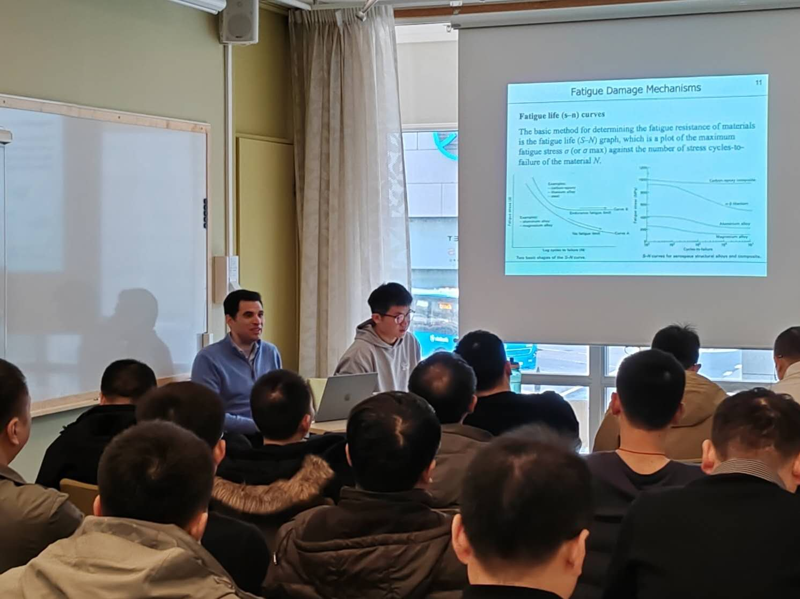

**1. Academic Lecture Interpretation**

I assisted [Prof. Essa](https://www.birmingham.ac.uk/staff/profiles/mechanical/essa-khamis) with organizing his academic lectures. I translated content on fatigue analysis, testing, and life extension, and provided real-time Chinese-English translation for him and the Chinese delegation, including a full day of consecutive interpretation.

This was my first time doing Chinese-English interpretation, and I was kind of nervous before starting. It was really a high-pressure, full-day academic session with many technical terms. But I prepared well and completed the task successfully. It was really a rewarding and enjoyable experience.

    
     
    

        Interpreting During Lecture
    

    
 

**2. Red Bird Challenge Camp** (The Hong Kong University of Science and Technology (Guangzhou))

 We've developed Bianque Online Clinic, an AI-driven healthcare service leveraging artificial intelligence technology. As an affiliated department of hospitals, we offer online diagnosis and medical services. Using intelligent algorithm models, Bianque Online Clinic analyzes user-input symptoms and medical history to provide preliminary diagnostic results and medical recommendations. AI online healthcare is designed to complement traditional healthcare systems, combining with conventional diagnosis to deliver more comprehensive and convenient medical services to individuals.

 [Project Results (Public)](../files/hkustgz.pdf)

**3. Science Summer Camp** (Fully funded by City University of Hong Kong)

The signature event of the College of Science attracted more than **1,300** enthusiastic applicants across all the continents, of which **52** campers who studied in Mainland China, Germany, Russia, Singapore, Vietnam, the UK, and Hong Kong, were accepted to join following a rigorous review and selection by four academic departments. The Science Summer Camp is designed to offer outstanding prospective PhD candidates to experience student life at CityU and to get a taste of excellent research education in science.

[Video Introduction](https://www.youtube.com/watch?v=VasSISuvbsk)

    
     
    

        Victoria Harbour in Hong Kong
    

    
 

    
     
    

        Tai Ping Shan in Hong Kong
    

    
 

