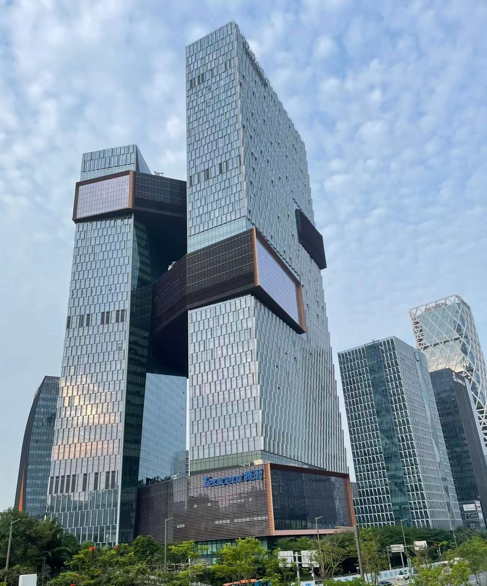
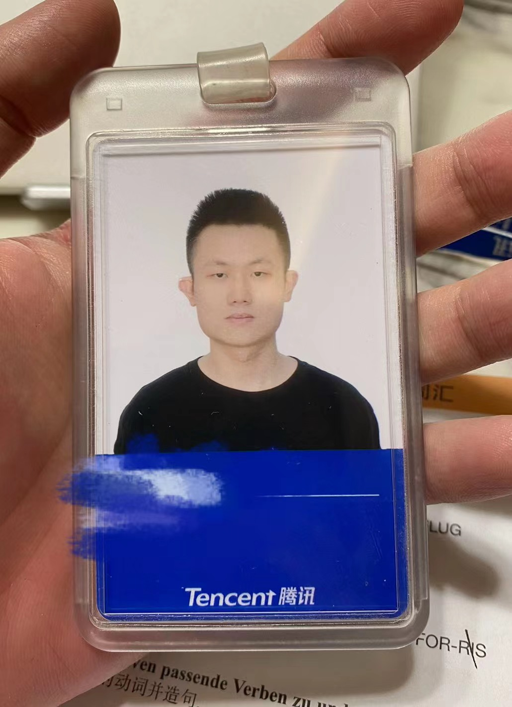
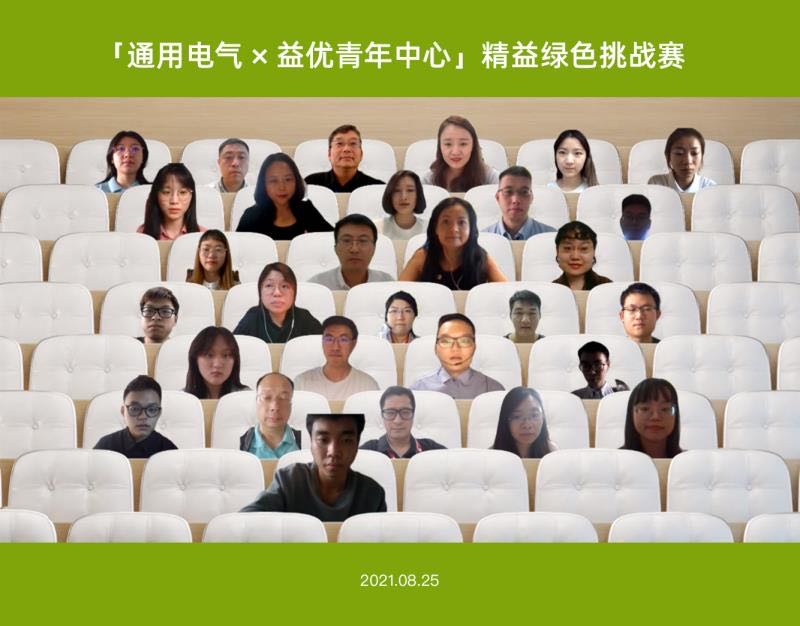

**[Tencent](https://www.tencent.com/en-us/)**

Data Analyst Intern, Data Platform Department

• Leveraged SQL and Python to collect and analyze key data metrics related to retention, user activity, etc. from specific gaming apps; modeled player characteristics and behaviors, enabling targeted insights and strategic decision-making.\
• Designed A/B tests based on North Star metrics to foster product iteration and enhance user quantity and quality; performed hypothesis testing to check the statistical significance of the results.\
• Structured and established a comprehensive framework for business data metrics and analysis; implemented an intelligent decision-making methodology; identified key business revenue growth opportunities.

**[General Eletric](https://www.ge.com/)**

Project Consultant, Hydro Center of Excellence

• Developed a virtual factory tour solution for clients unable to visit during the COVID-19 pandemic, saving the factories an estimated annual cost of 150,000 yuan in client visit expenses and reducing carbon emissions by 365,000 kg per year.\
• Conducted on-site visits to factories, engaged with factory officials, gathered display elements, standardized the elements, visualized the displays, and designed the online factory tour webpage and process.\
• Cooperated with 7 members effectively; assigned tasks based on members’ strengths and scheduled the meetings.

Relevant Information
------
1. Memories at Tencent

    
     
    

        Office Building
    

    
 

    
     
    

        Work Badge
    

    
 

2. Memories at GE

    [**Project Results (Public)**](../files/GE2.pdf)

    
     
    

        Online Meeting under Pandemic
    

    
 

