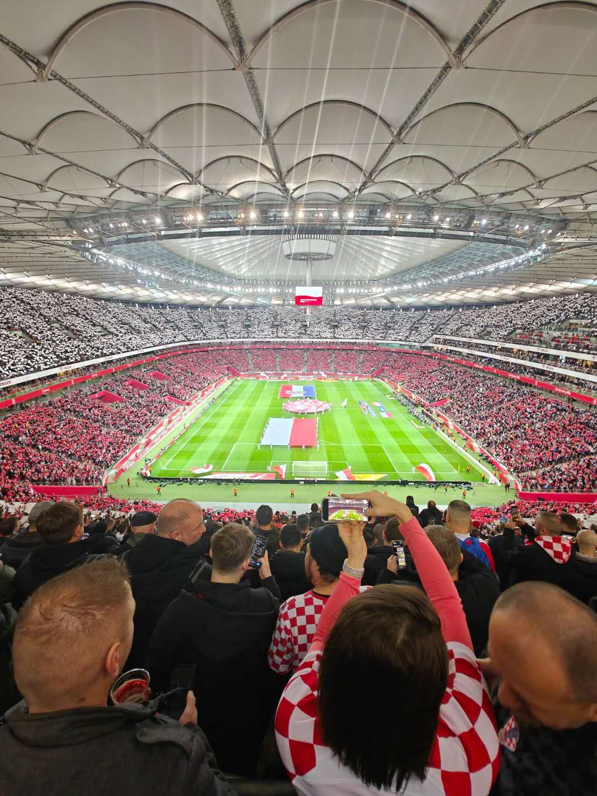
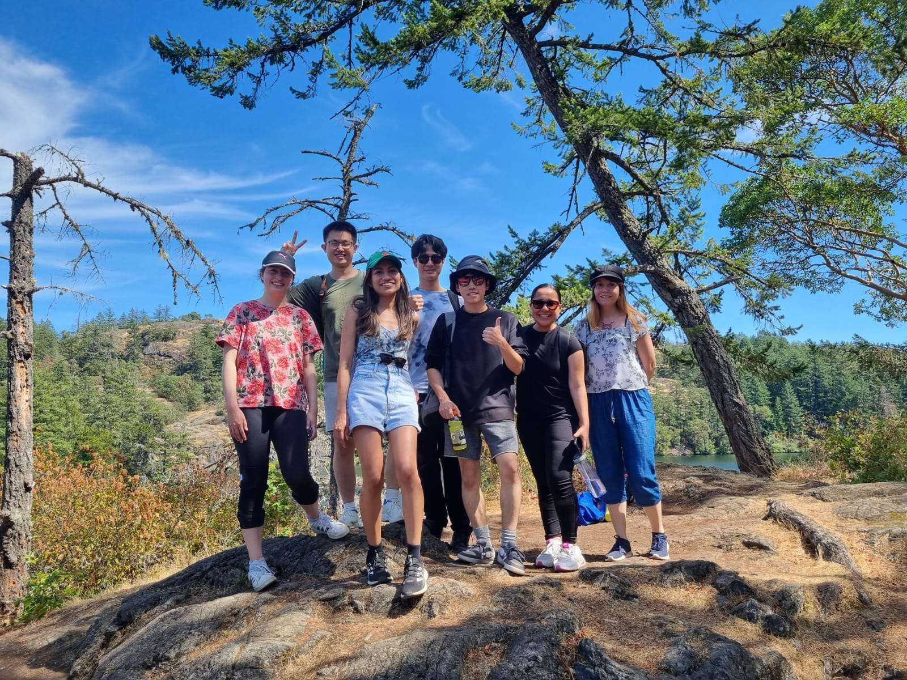

My parents have a great passion for travel and have been taking me on trips since my childhood. Influenced by them, I developed a deep love for exploring. I've visited nearly all 34 provinces in China and over 40 cities, with three road trips covering over 2000 km each. I have also had the opportunity to explore other countries.

Read ten thousand books; travel ten thousand miles. I always gain a lot during my journeys. I respect and cherish diverse cultures, hoping to make friends from different countries and backgrounds. I want to explore the unknown with my curiosity and a sense of reverence.

    
     
    

        With Jörgen Persson, Swedish Table Tennis World Champion (in Gothenburg)
    

    
 

    
     
    

        UEFA Poland 3:3 Croatia
    

    
 

After coming to Europe to study, I developed a habit of watching football matches in different cities because the football atmosphere here is amazing. I've been to several cities and stadiums, but the Poland vs. Croatia match stands out the most for me.

It was a home game for Poland, and I could only get a ticket for the Croatian fan section. With 58,000 people in the stadium supporting Poland, there were probably only around 400 Croatian supporters. I felt like the only Asian face in the crowd, standing with the Croatian fans to cheer for them.

Since the police closely monitor away fans to prevent clashes, they kept checking with me to make sure I had the correct ticket. Hahahaha, it was definitely an interesting experience, and I’ll remember this experience for a long time.

    
     
    

        Victoria, Canada (During Mitacs Globalink Research Internship (Fully-Funded))
    

    
 

    
     
    

        Banff National Park, Canada (During Mitacs Globalink Research Internship (Fully-Funded))
    

    
 

    
     
    

        Hong Kong, China (During Science Summer Camp (Fully-Funded))
    

    
 

    
     
    

        Shenzhen, China (the city where I interned, with my cute little brother)
    

    
 

