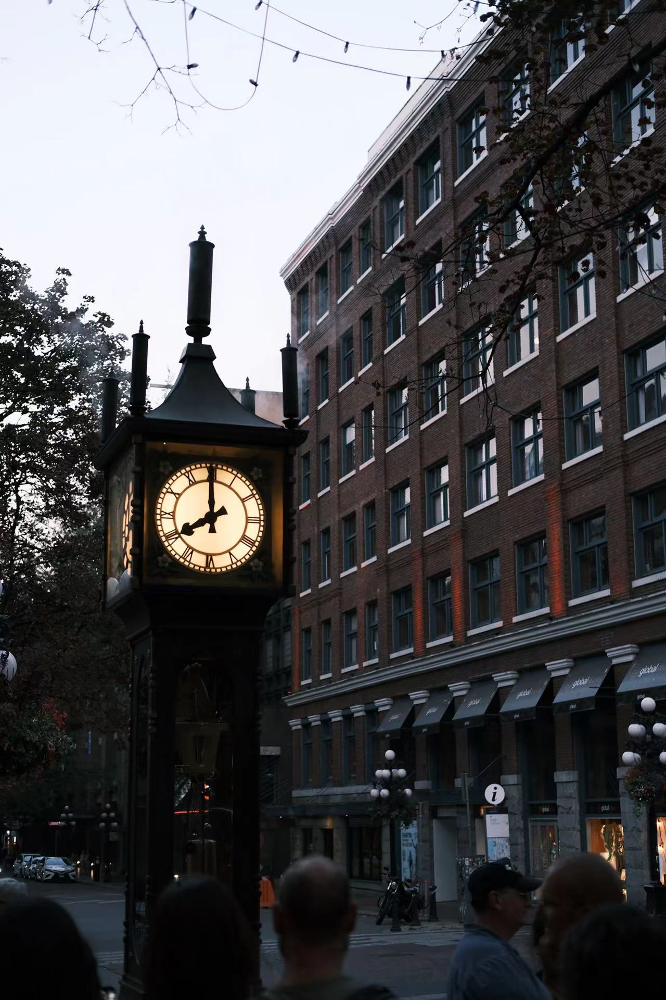
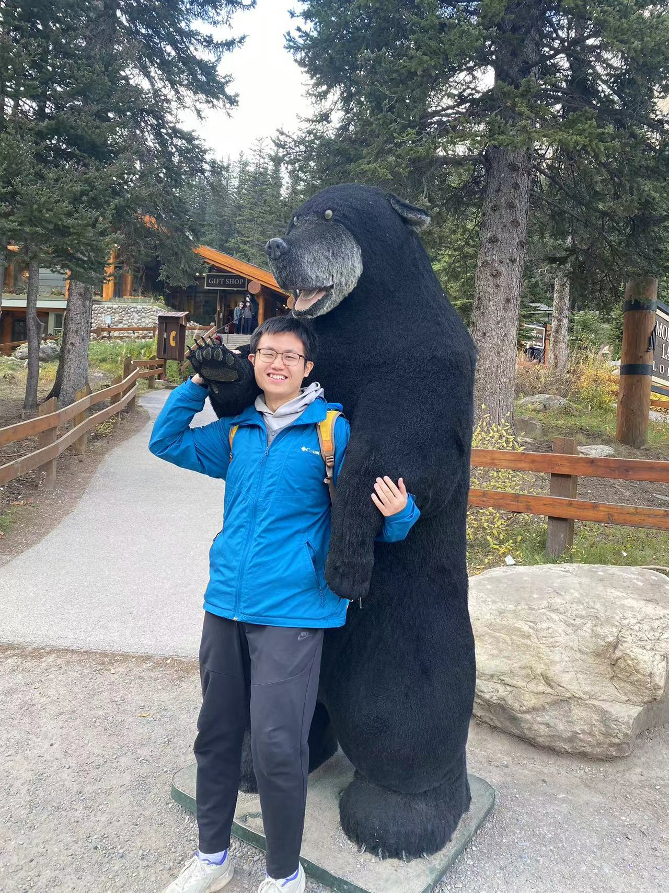
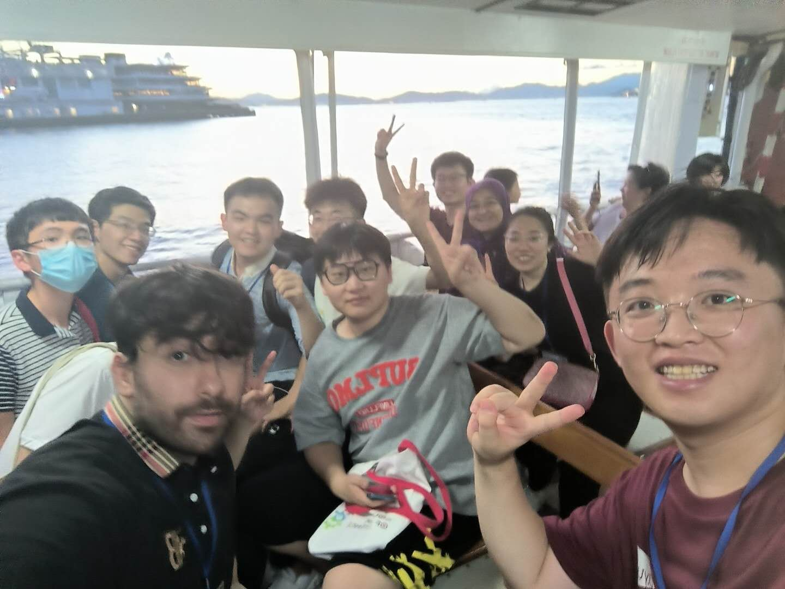
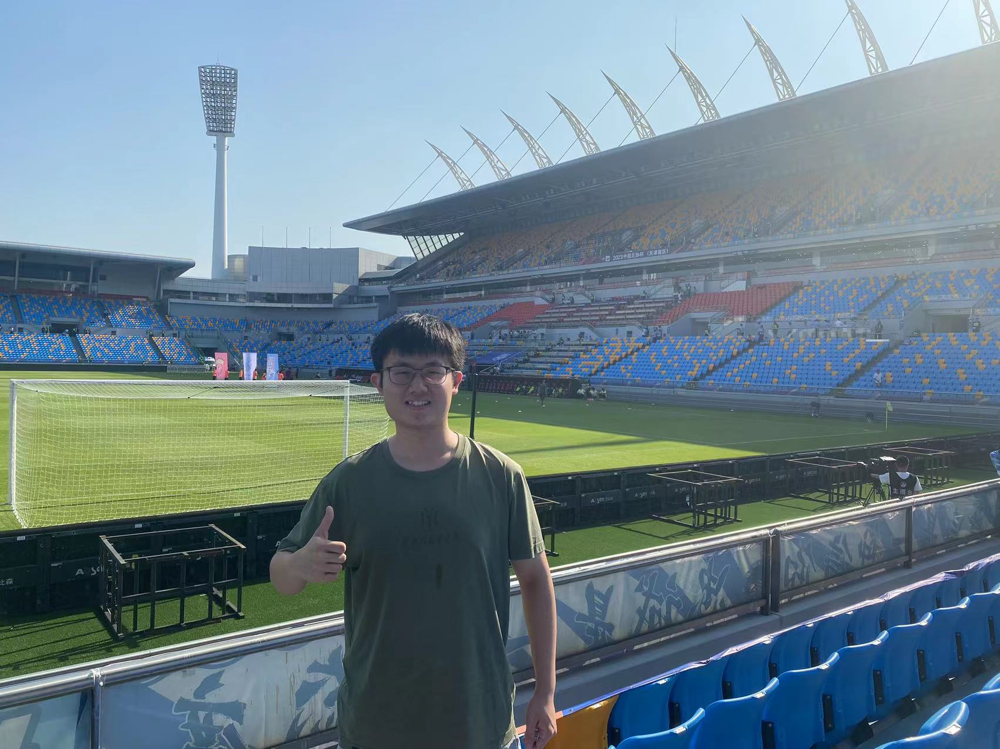
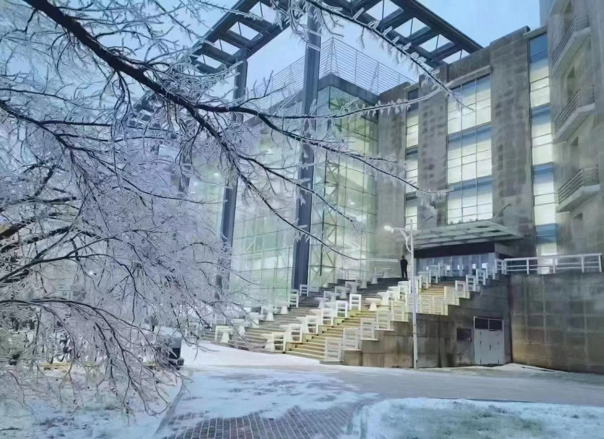
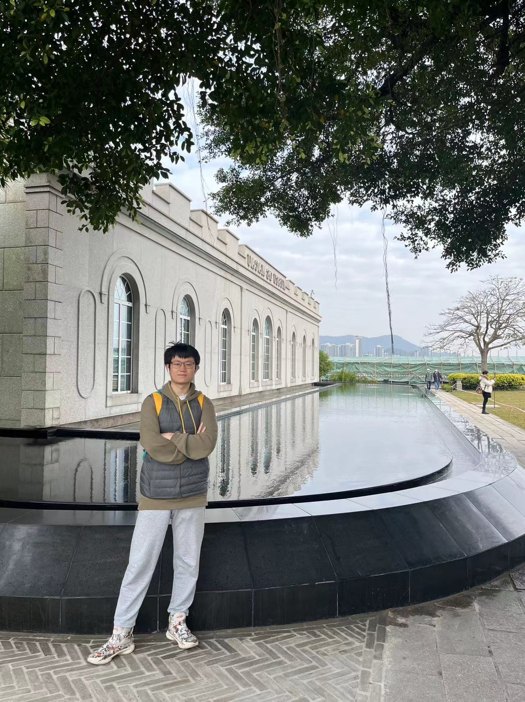
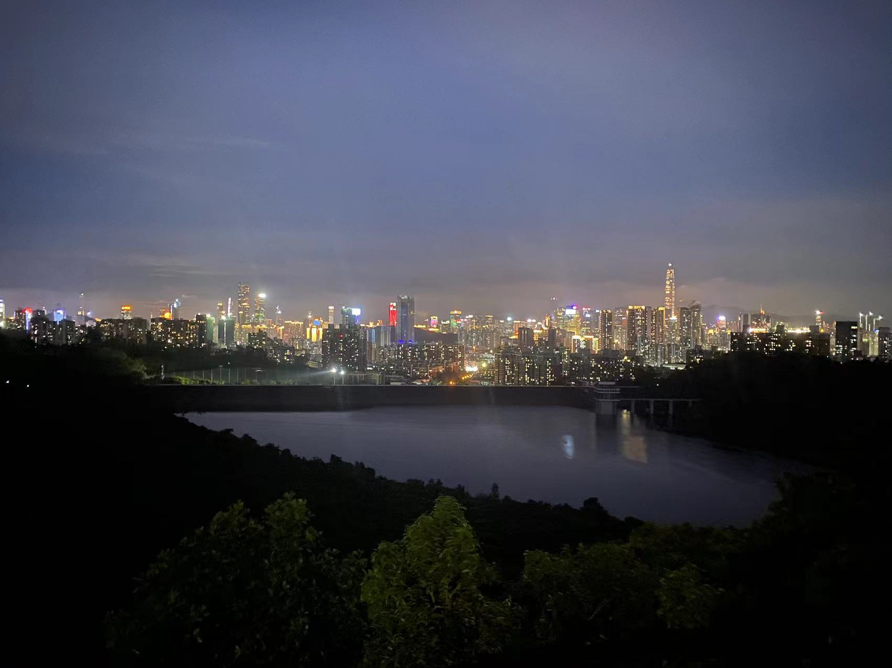

My parents have a great passion for travel and have been taking me on trips since my childhood. Influenced by them, I developed a deep love for exploring. I've visited nearly all 34 provinces in China and over 100 cities, with three road trips covering over 2000 km each. I've also explored other countries, including Japan, Singapore, the UAE, Germany, France, Italy, Switzerland, the United States, and Canada. I respect and cherish diverse cultures and hope to make friends from different countries, backgrounds, and cultures.

    
     
    

        Victoria, Canada (Druing Mitacs Globalink Research Internship (Full-Funded))
    

    
 

    
     
    

        Vancouver, Canada (Druing Mitacs Globalink Research Internship (Full-Funded))
    

    
 

    
     
    

        Banff National Park, Canada (Druing Mitacs Globalink Research Internship (Full-Funded))
    

    
 

    
     
    

        Hong Kong, China (Druing Science Summer Camp (Full-Funded))
    

    
 

    
     
    

        Tianjin, China (the city where I grew up)
    

    
 

    
     
    

        University Library, Changchun, China (the city where my university is located)
    

    
 

    
     
    

        Macao, China
    

    
 

    
     
    

        Shenzhen, China (the city where I took my internship)
    

    
 

